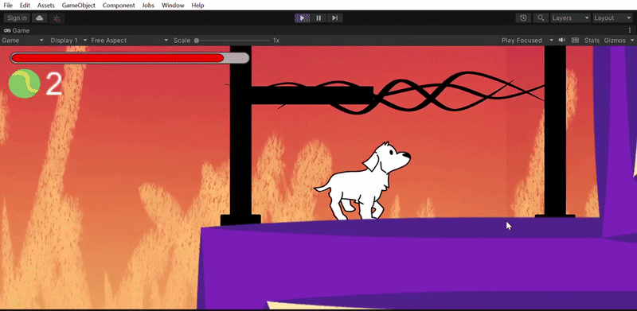

# Way Back Home 🏠

<p align="center">
  
</p>

Un videojuego de plataformas 2D con un enfoque narrativo y mecánicas clásicas, desarrollado en Unity. Este proyecto demuestra el uso de físicas 2D, gestión de estados del personaje y diseño de niveles dinámicos.

## 🚀 Key Features

* **Sistema de Movimiento 2D:** Implementación de físicas para caminar, saltar y respuesta de colisiones.
* **Mecánicas de Obstáculos:** Zonas de peligro dinámicas (Veneno) y gestión de prefabs para proyectiles (Balas).
* **Gestión de Assets:** Organización eficiente de sprites, sonidos (SFX) y prefabs para una iteración rápida.
* **Atmósfera Inmersiva:** Integración de música y efectos visuales para reforzar la experiencia del jugador.

## 📁 Project Structure

* **/Content :** Carpeta principal con todos los recursos visuales (Sprites), audios y prefabs del juego.
* **/Juego2D_Isabela :** Contiene la configuración base del motor y el árbol de dependencias.
* **/Packages :** Dependencias del proyecto y herramientas de Unity integradas.
* **/ProjectSettings :** Configuraciones optimizadas de físicas, capas y resolución de pantalla.

## 🛠️ Technical Requirements

* **Unity Version:** 2021.3+ (LTS recomendada)
* **Render Pipeline:** 2D Renderer
* **Target Platforms:** PC Standalone / WebGL

## ⚙️ Setup & Installation

1. **Clone the repository:**
    ```bash
   git clone https://github.com/Isabela-Tellez/Way-Back-Home.git
   ```

2. **Open with Unity Hub:** Select the project folder and ensure you have the correct Unity version installed.
3. **Escenas:** Localiza la escena principal en la carpeta de contenido para ejecutar el juego.

---
Developed by [Isabela Téllez](https://github.com/Isabela-Tellez)

## Features
- 2D Side-scroller mechanics.
- Custom pixel art assets.
- Responsive player controls.
- Immersive atmosphere and sound design.
